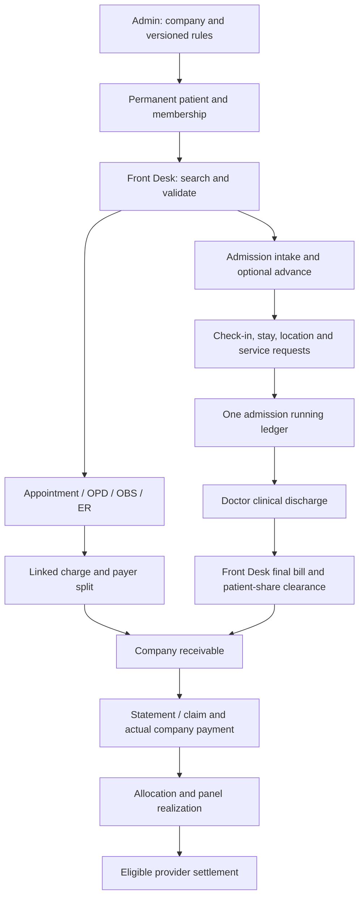

# Panel Patient v7.4 - Complete Working Context and Three-Step Implementation

**Created:** 2026-09-23  
**Primary source:** [CHSS_HMS_Panel_Patient_Complete_Flow_Forms_v7_4.pdf](CHSS_HMS_Panel_Patient_Complete_Flow_Forms_v7_4.pdf), 27 pages, sections 1-22.  
**Current status:** Session 1 implementation completed for the coverage/company foundation and selected billing integrations; the complete v7.4 flow is NOT finished. See section 12 for verified changes and the exact next-session backlog.  
**User direction:** Panel patient ka complete frontend/backend flow dynamic hoga; koi hardcoded business data nahi hoga; har record save aur linked rahega; implementation 3 steps mein hogi.

Use this file at the start of every panel-work session and update the progress log at the end. For panel behavior, the supplied v7.4 PDF takes precedence over older panel descriptions in `PROJECT_MASTER_SPEC.md`, `HMS_V7.2_NEW_REQUIREMENTS.md`, and `admission.md`. Preserve compatible existing admission functionality. Do not interpret old implementation-completion notes as proof of v7.4 compliance.

## 1. Scope and non-negotiable rules

1. One Panel Company Master supports Employer/Corporate, Insurance, and Institutional/Contract categories. XYZ Company, ABC Insurance, and Corporate Panel A are examples, never production defaults or separate modules.
2. A panel patient is a permanent reusable identity. Reuse the same hospital Panel Patient ID/MRN for appointments, OPD, Observation, Emergency, and admissions.
3. Hospital MRN and external Employee/Member/Policy/Beneficiary ID are different fields. Changing membership must not replace the patient's hospital identity or rewrite previous financial ownership.
4. Super Admin/Admin configure companies, contracts, tariffs, and coverage. Authorized Front Desk can register patients only under existing active companies. Admission cannot register patients or collect patient money.
5. Resolve coverage in this exact order: **Service -> Department -> Global -> NOT_COVERED**. An explicit Not Covered rule stops fallback. No applicable rule means full eligible amount payable by patient and zero panel receivable.
6. Patient share and panel receivable are separate balances. A receivable is not a receipt or realized collection.
7. Admission starts at Front Desk and is handed off to Admission. Initial location, estimate, advance, authorization, and fulfillment selections must persist.
8. Estimated Amount is informational only. It must never generate a charge or affect final payable. An advance is an actual receipt/credit, never a service charge.
9. One patient-facing admission running ledger accumulates the stay's charges and receipts. Department invoices/source ownership remain linked underneath.
10. Hospital Managed fulfillment can create eligible internal charges. Self Managed/External keeps operational history but creates no internal charge or outsourced payable for that line.
11. Clinical discharge and financial clearance are separate. Open company receivables may remain after exit only according to configured contract/guarantee policy.
12. Unpaid company receivable cannot enter outsourced settlement eligibility. Only actual realized amounts can contribute, under the applicable provider agreement.
13. Companies, category settings, departments, services, rates, coverage, authorization policies, and selectable business statuses must come from persisted configuration. Frontend must not manufacture missing configuration or silently substitute demo values.

## 2. Source coverage map

| PDF section / pages | Requirement | Implementation step |
|---|---|---|
| Introduction; 1 / pp. 1-3 | Single company master, categories, permanent identity, full flow | 1-3 |
| 2 / p. 4 | Company setup and common form | 1 |
| 3 / p. 5 | Category-specific settings | 1 |
| 4 / p. 6 | Coverage/tariff scopes and payer split | 1, consumed in 2-3 |
| 5 / p. 7 | Registration ownership and duplicate prevention | 1-2 |
| 6 / p. 8 | Permanent patient registration fields | 1-2 |
| 7 / p. 9 | Return-visit search and membership revalidation | 1-2 |
| 8 / pp. 10-11 | Common Front Desk encounter flow | 2 |
| 9 / p. 12 | Encounter fields and authorization | 2 |
| 10 / p. 13 | Category examples and illustrative amounts | 2 validation |
| 11 / pp. 14-15 | Panel admission intake/handoff | 2 |
| 12 / p. 16 | Admission form fields | 2 |
| 13 / p. 17 | Patient/guardian documents | 2-3 |
| 14 / pp. 18-19 | Admission management and clinical discharge | 3 |
| 15 / p. 20 | Outsourced/pharmacy fulfillment | 2-3 |
| 16 / p. 21 | Continuous admission ledger | 3 |
| 17 / p. 22 | Interim statement fields | 3 |
| 18 / p. 23 | Clinical discharge and financial clearance | 3 |
| 19 / p. 24 | Claims, company payment, realization, settlement | 3 |
| 20 / p. 25 | Three end-to-end examples | 3 acceptance |
| 21 / p. 26 | Required screens across portals | 1-3 |
| 22 / p. 27 | Final locked business rules | All steps |

Analysis method: text extracted from all 27 pages using local Poppler `pdftotext`; admission form also checked in raw extraction order because layout extraction displaced required-value cells. No PDF rendering tool was available on PATH; this is a functional/text analysis, not a visual-layout certification of the source PDF.

## 3. Roles and operational ownership

| Operation | Super Admin / Admin | Authorized Front Desk / Billing | Admission |
|---|---|---|---|
| Create/edit/deactivate company and category settings | Yes | No; read active choices | Read as needed |
| Configure coverage/tariffs | Yes | No | No |
| Register/manage permanent panel patient | Yes | Register under active panel; permitted profile actions | No |
| Search existing panel patient | Yes | Yes | Read linked admission identity |
| Create encounter/admission intake | Oversight/as permitted | Yes | Receives intake; no new registration |
| Collect patient advance/payment | Billing-authorized workflow | Yes, attributable cashier receipt | No |
| Manage check-in, location, stay, requests | Oversight | Intake and financial visibility | Yes |
| Authorize clinical discharge | Doctor credentials required | Cannot replace clinical authorization | Doctor-authorized workflow |
| Final billing/financial clearance | Authorized billing/admin | Yes | Read status |
| Company claims/remittances | Authorized billing/admin | According to billing permissions | No collection |

Enforce boundaries at API/service level, not merely by hiding buttons. Lookup permissions must work for Front Desk without granting company/rule write permission.

## 4. Complete forms and persisted data

Requiredness below comes from the PDF. Where it says configurable/conditional, the selected panel's saved settings determine both visible frontend fields and backend validation.

### 4.1 Panel Company common form (PDF section 2)

| Field | Requiredness / behavior |
|---|---|
| Panel Code | Required, unique, generated or entered under hospital policy |
| Panel Name | Required; actual configured organization name |
| Panel Category | Required; Employer/Corporate, Insurance, Institutional/Contract behavior |
| Legal / Billing Name | Optional; claim/statement identity when different |
| Contact Person | Optional |
| Phone / Email | Optional |
| Billing Address | Optional |
| Member Validation Required | Required configuration value |
| Authorization Required | Configurable for treatment/admission |
| Billing Terms | Optional persisted terms/cycle, no hardcoded monthly assumption |
| Credit Limit | Optional, with explicit configured handling if used |
| Status | Required Active/Inactive; inactive blocks new cases |
| Notes | Optional operational notes |

### 4.2 Category-specific settings (PDF section 3)

| Category | Settings and behavior |
|---|---|
| Employer / Corporate | Optional Employee/Member ID label; configurable employee relationship requirement; optional department/grade/designation entitlement metadata; configurable guarantee requirement; coverage/co-pay rules required for covered billing |
| Insurance | Configurable policy/member number requirement; effective/expiry date requirements; pre-authorization for admission or selected services; case-specific authorization reference/limit; coverage, exclusion, co-pay rules |
| Institutional / Contract | Configurable beneficiary/member number; optional package/contract reference; configurable referral/authorization; special tariff/package rules where used; fixed/percentage/not-covered patient share rules |

Category settings belong to the organization/contract. Actual member values belong to membership. Case approvals belong to visits/admissions. A free-text note cannot substitute for structured limits or validity checks.

### 4.3 Coverage and tariff rule form (PDF section 4)

| Field | Requiredness / behavior |
|---|---|
| Panel Company | Required linked company |
| Rule Scope | Required Service / Department / Global |
| Department | Required for Department scope, active database lookup |
| Service | Required for Service scope, database Services & Rates lookup |
| Coverage Type | Required Percentage / Fixed Patient Share / Full Coverage / Not Covered |
| Coverage Value | Required when percentage or fixed amount applies |
| Contract Tariff / Rate | Optional replacement contract rate |
| Effective From | Required |
| Effective To | Optional |
| Authorization Required | Optional rule-specific requirement |
| Status | Required Active/Inactive |
| Notes | Optional contract notes |

Use one backend resolver for preview AND actual posting across every billable path. Return the matched scope/rule/version, applied tariff, adjustment, eligible net, patient share, company share, and authorization requirements. Persist posting-time results; do not recalculate historical bills from today's rules.

### 4.4 Permanent Panel Patient registration (PDF sections 5-7)

| Field | Requiredness / behavior |
|---|---|
| Panel Company | Required active configured company |
| Panel Category | Derived from company; not retyped |
| External Member / Employee / Policy ID | Per panel configuration |
| Hospital Panel Patient ID / MRN | System-generated permanent identity; display format configured |
| Full Name | Required |
| Father / Husband / Guardian Name | Optional/configured |
| CNIC / B-Form | Optional/configured |
| Gender | Required |
| Date of Birth / Age | Required; DOB preferred; track supplied age honestly when DOB unknown |
| Mobile Number | Required |
| Address | Optional |
| Principal / Employee Name | Conditional for dependents |
| Relationship to Principal | Conditional, e.g. self/spouse/child/dependent |
| Membership Effective From | Optional/configured |
| Membership Expiry | Optional/configured, enforced for new covered transactions |
| Policy / Plan / Package | Conditional |
| Default Authorization / Reference | Optional persistent reference only |
| Status | Active/Inactive/Expired as supported; membership status distinct from patient life status |
| Notes | Optional non-financial notes |

Before save, search MRN, external member ID, CNIC/B-Form, phone, and name + DOB. Offer existing records instead of recreating them. A shared family phone or principal policy number is a likely-match signal, not necessarily a duplicate person; define dependent-aware identity constraints. Search must query the backend with pagination, not only a preloaded local cache. Historical inactive/expired records remain discoverable.

### 4.5 Front Desk encounter form (PDF sections 8-10)

Required linked permanent patient; auto-loaded company and external member ID; encounter type Appointment/OPD/Observation/Emergency; optional doctor where configured, selected from eligible active doctors; required service for billable encounters; auto-resolved standard/contract rate; conditional authorization/referral number, limit and validity; calculated patient share and panel receivable; conditional patient payment amount and supported payment method; optional remarks.

Flow: select Panel -> search/reuse or quick-register under active company -> validate membership -> choose flow/service -> capture required approval -> obtain server billing preview -> collect permitted patient share -> save linked encounter, financial record, and receipt. Partial payment is allowed only under configured billing rules. A zero patient share must not require a fake zero-value cash receipt.

### 4.6 Front Desk admission intake (PDF sections 11-12)

| Field | Requiredness / behavior |
|---|---|
| Panel Patient | Required existing/quick-registered permanent patient |
| Panel Company / External ID | Loaded from selected membership |
| Authorization / Guarantee Required | Derived from rules |
| Authorization / Guarantee Number | Conditional |
| Authorization Limit / Valid Until | Optional/conditional case controls |
| Admission Reason | Required administrative/provisional reason |
| Provisional Diagnosis | Optional, distinct from administrative reason |
| Admitting / Consultant Doctor | Optional; may be Not Assigned Yet |
| Ward / Room / Bed | Per configured hierarchy and availability; room can be optional |
| Estimated Amount (PKR) | Optional manual informational estimate only |
| Advance Amount | Optional actual patient payment/credit |
| Payment Method / Reference | Applicable when advance is collected |
| Outsourced Services Fulfillment | Default Hospital Managed; External only where allowed |
| Pharmacy Fulfillment | Default Hospital Managed; External only where allowed |
| Attendant Name / Relationship / Phone | Recommended |
| Notes | Optional |

Generate Admission Number and Admission Slip. Persist intake and receipt safely, then expose the same case in Incoming/Planned Admissions. Estimate print label: **Estimated Amount - Subject to Final Billing**. Do not create an unrelated patient master during handoff or conversion from ER/OPD to admission.

## 5. Admission, discharge, and receivable lifecycle

### 5.1 Stay and fulfillment

- Admission confirms check-in and bed occupancy, manages transfers, services/procedures, outsourced requests, and pharmacy requests.
- Keep all requests and their completion/fulfillment history linked to the admission and source department/service.
- Both outsourced and pharmacy defaults are Hospital Managed and survive refresh/handoff.
- Self Managed/External must be unavailable when the configured service/department does not support it. Preserve the external need/request/history without generating an internal bill or payable.
- Ward one-time configured charge posts once. Room daily charge follows configured billing behavior. Both must use appropriate panel coverage; neither may infer full coverage from patient type alone.
- Pharmacy charge follows integrated/dispensed activity and hospital-managed fulfillment. Prevent duplicate charges from repeated bridge events.
- Admission sees payment status read-only. Clinical discharge requires valid doctor credentials and summary: final diagnosis, treatment summary, condition, instructions, follow-up. Never persist credentials in case notes or printouts.

### 5.2 Running statement (PDF section 17)

Persist underlying records; derive totals consistently from them. Display:

| Statement field | Meaning |
|---|---|
| Patient / admission identity | Hospital MRN, external member ID, Admission Number |
| Panel company | Historical payer for the case |
| Gross charges | Eligible internal hospital-managed charges before contract adjustment |
| Contract adjustment / benefit | Explicit tariff/contract reduction |
| Net eligible | Amount after contract adjustment |
| Patient share | Patient-payable component |
| Panel receivable | Organization-payable component |
| Patient payments / advance | Actual receipts, allocations and available credit without double counting |
| Panel paid / realized | Actual company payments allocated to these obligations |
| Patient outstanding | Patient share less applicable patient payments/credit |
| Panel outstanding | Panel receivable less actual panel realization |

Required interim label: **INTERIM / RUNNING STATEMENT - NOT FINAL INVOICE**. Printing this statement does not close the admission or create a new charge.

### 5.3 Final billing and financial clearance

After clinical discharge, status communicates **Clinically Discharged - Billing Pending**. Front Desk reviews the same ledger, applies advances/prior payments, collects remaining patient share, and generates the final consolidated bill/statement with separate payer amounts. Contract/guarantee policy determines whether financial clearance can proceed while panel receivable remains open. Patient exit is not equivalent to company settlement.

### 5.4 Company statement, claim, and remittance

Accumulate company receivable by patient, encounter/admission, department, and service. Generate a statement/claim for the selected billing period and contract. Keep claim content and submission history linked. Record actual company payment separately from patient receipts; allocate it to specific panel obligations; only allocated received amounts become Panel Realized. Update eligible provider settlement from realized collections under the provider agreement, accounting for prior settlements and reversals.

The PDF specifies statement/claim creation and sending, but not an insurer API, email provider, or electronic claim format. Build saved/exportable claims and recorded submission references first; automatic external transmission needs a separately selected integration.

### 5.5 Patient/guardian outputs (PDF section 13)

| Stage | Output |
|---|---|
| Registration | MRN confirmation/card/printout if hospital chooses; membership reference retained |
| OPD / OBS / ER | Actual patient-share receipt and visit slip where applicable |
| Admission start | Admission Slip, location details, actual advance receipt, relevant authorization reference |
| During stay | Every additional payment receipt and requested running statement |
| Clinical discharge | Doctor discharge summary, medicines/instructions/follow-up |
| Final billing | Consolidated final bill, actual final payment receipt, optional clearance/gate pass |

Internal digital/clinical case file remains in the hospital system. Reprints must load saved records, not unsaved form state or invented receipt numbers.

## 6. Financial rules and integrity design

The following are implementation requirements derived from the flow; details not fixed by the PDF are proposals to resolve during the relevant step.

Let `G` be standard gross, `A` be contract adjustment, `N = G - A` be eligible net, `P` patient share, and `R` panel share. Always reconcile **P + R = N** using decimal money arithmetic and an explicit rounding policy.

| Coverage | Patient share P | Panel share R |
|---|---|---|
| Full coverage | 0 | N |
| Percentage coverage c | N - R | N * c / 100 |
| Fixed patient share f | Configured f within eligible amount | N - P |
| Explicit Not Covered | N | 0 |
| No active applicable rule | N | 0 |

Validate 0-100 percentages, nonnegative money, valid effective windows, scope/reference consistency, active service/department selection, and deterministic matching. Proposed fixed-share guard: do not permit a patient share above N; choose reject/clamp semantics explicitly. Existing legacy discounts are hospital price reductions, not company receipts; migrate their meaning separately from coverage percentages.

For historical accuracy and complete linkage:

1. Use permanent database identifiers and foreign keys, plus human-readable MRN/admission/invoice/receipt/claim/remittance numbers generated safely under concurrency.
2. Keep membership versions/history, including company, external ID, plan, relationship and validity. Save the actual membership/payer reference on each case and obligation. Never infer old debt ownership only from the patient's current company.
3. Snapshot applied rule/version, service/department ownership, quantity, standard/contract rate, adjustment, eligible net, payer split, and authorization reference at posting.
4. Save actors, timestamps, status changes and reasons for registration, membership changes, rule revisions, approvals, requests, charges, receipts, discharge, clearance, claims, remittances and corrections. Existing `createdAt/updatedAt` alone do not preserve every change.
5. Keep referenced companies/services/rules historically readable when deactivated. Avoid destructive replacement of referenced contract history. Financial corrections use traceable reversal/adjustment records, not deletion of posted history.
6. Save charge + invoice totals + allocations atomically where they belong to one action. Add idempotency for retries, duplicate clicks and external fulfillment events.
7. Reject cross-company allocation, duplicate invoice allocation entries, over-allocation and mismatched sums. Recheck outstanding under concurrency protection; a transaction wrapper alone does not prevent concurrent overpayment.
8. Keep patient credit and company payment separate. Excess patient advance remains explicit credit/refund handling; never quietly consume it as company payment or discard it when displaying zero outstanding.
9. Receipt totals, allocation totals, invoice/line totals, admission totals, company statements and provider realization must reconcile from the same persisted sources.
10. A configuration edit affects future applicable posting; it must not silently reprice already-posted lines, historical receipts or finalized documents.

Proposed relationship map (names for new entities are provisional):

`Company -> Contract/Rule Versions -> Membership History -> Permanent PanelPatient`

`PanelPatient + Case Membership -> Encounter/Admission -> Case Authorization -> Requests/Fulfillment -> Department Invoice -> Charge Lines`

`Patient Receipt -> Patient Allocations / Admission Credit -> Same Invoice Obligations`

`Company Claim -> Claim Lines / Panel Obligations -> Remittance -> Panel Allocations -> Realized Provider Eligibility`

`Admission -> Location History + Discharge Summary + Financial Clearance + Final Statement Version`

Prefer extending current entities/services over creating a competing billing system. A new membership/history relation is a proposed migration to preserve identity; it does not imply the PDF mandates simultaneous multi-panel membership.

## 7. Repository assessment as of 2026-09-23

This is a static source review, not a live database/browser verification. Existing code is a useful base but is not confirmed as fully v7.4 compliant. No application files were changed during this analysis.

Stack: React 19 + TypeScript + Vite frontend; Node.js + Express + TypeScript backend; Prisma + PostgreSQL persistence.

Paths below use `FE = ch-sharif-and-saeed-hospital---hms/src` and `BE = hms-backend/src`.

| Area | Observed evidence | Required work / risk |
|---|---|---|
| Company management | `BE/modules/setup/setup.*`; `FE/services/panelService.ts`; `FE/features/superAdmin/corporatePanels/SuperAdminCorporatePanelsView.tsx` already use live APIs | Extend structured company/category settings; UI currently has a fixed category array and fallback Corporate Enterprise value |
| Database base | `hms-backend/prisma/schema.prisma`: CorporatePanel, PanelPatient, PanelDiscountRule, invoices, lines, admissions, receipts, remittances | Add missing membership, category policy, rule scope/history and case authorization structures with migrations |
| Coverage | `BE/shared/panelCoverage.ts` is reused by appointments/admission and panel preview | Currently service-only percentage/cap or legacy discount; no department/global fallback, full rule-type model or contract tariff handling |
| Rule history | `setup.service.ts::replaceDiscountRules` deletes existing company rules then recreates them | Version/preserve history and store posting snapshots; do not lose original contract basis |
| Patient creation | `BE/modules/frontdesk/patients.service.ts::createPanelPatient` generates MRN and saves patient | No explicit active-company validation or duplicate guard inside this creation method; gender/DOB/mobile are optional in current schema validation |
| Patient search | `patients.service.ts::listPanelPatients` searches name/MRN/CNIC/phone; duplicate endpoint checks CNIC/phone | Add external member ID and name+DOB matching; normalize identifiers and handle dependent/family matches |
| Membership verification | `panelBilling.service.ts::verifyPanelPatient` checks patient flags/status and company activity | No membership effective/expiry/plan validation in current patient model; apply common validation to every write path, not only standalone verification |
| Patient-company changes | Patient update accepts partial registration including company ID; panel statements/remittances find invoices through patients currently in a company | Changing company can misattribute past receivables; snapshot/version payer ownership before enabling membership transitions |
| Panel billing APIs | `/api/v1/panel-billing`: verify, contract-resolution, company statement, create/list remittances | Expand case-aware validation, period claims, history, dynamic configuration and reliability |
| Remittance allocation | Transactional manual/proportional allocation exists; company remittance does not change patient `paidTotal` | Manual entries are checked individually, not grouped for duplicate invoice IDs; add aggregate guards, rounding boundaries, idempotency and concurrent allocation protection |
| Contract preview | `panelBilling.service.ts::resolveContract` loads patient/rules and service | It does not itself apply full active membership/service/auth validation; preview and posting must use the same authoritative context |
| Ward charge | `BE/modules/admission/admission.service.ts` one-time ward-charge path sets zero patient share and full panel share whenever `invoice.panelPatientId` exists | Confirmed v7.4 mismatch: route through common coverage resolver; no rule must mean full patient share |
| Admission base | `AdmissionRecord` has linked patient, optional doctor, location, estimate, fulfillment modes, final bill identity; intake and active-admission screens exist | Extend structured admission reason/attendant/case approval data; verify saved handoff and all posting paths |
| Running ledger | `BE/modules/frontdesk/admissionBilling.service.ts` already computes patient/panel balances and panel realized allocations | Verify gross vs net/adjustment fields, credits, zero-panel-share lines, finalized snapshots and complete statement fields |
| Company statement scope | Current company statement queries only invoices with `panelReceivable > 0` | Appropriate for receivable listing, insufficient as a full patient clinical/financial history; keep these views distinct |
| Provider settlement | `BE/modules/setup/setup.schemas.ts` notes automatic eligibility derivation as future work; settlement service takes supplied eligible realized amount | Connect eligibility to actual persisted collections/allocations; do not treat user-supplied eligible amount as sufficient proof |
| Role base | `BE/middleware/authorize.ts`: Front Desk setup read-only; Admission frontdesk read-only | Verify operation-specific admission guards; Admission has broad admission-module access, which alone does not prove intake/payment restrictions |
| Frontend base | Registry, Front Desk intake/admission, panel verification/statement/remittance, Admission stay/discharge screens exist | Reuse and integrate; inspect every form-to-API mapping and avoid local-cache-only patient searches or calculations |

### 7.1 Main integration files

- Backend: `prisma/schema.prisma`, `src/modules/setup/setup.schemas.ts`, `setup.service.ts`, `setup.routes.ts`, `src/shared/panelCoverage.ts`, `src/shared/idGenerator.ts`, `src/middleware/authorize.ts`.
- Backend patient/encounter: `src/modules/frontdesk/patients.*`, `appointments.*`, `invoices.*`, `panelBilling.*`.
- Backend admission/finance: `src/modules/admission/admission.*`, `src/modules/frontdesk/admissionBilling.*`, pharmacy/pharmacy-bridge posting, setup provider settlements and financial reporting.
- Frontend setup/registry: `src/services/panelService.ts`, `src/features/superAdmin/corporatePanels/`, `src/features/superAdmin/patientRegistry/`, patient services/types.
- Frontend encounters/intake: `src/features/frontDesk/encounterIntake/`, appointment flow, `src/features/frontDesk/newAdmission/NewAdmissionView.tsx`, `src/services/frontdeskApiService.ts`, `admissionApiService.ts`.
- Frontend ledger/receivables: `src/features/frontDesk/admissionRecords/`, `src/features/frontDesk/billing/`, `src/features/frontDesk/panelBilling/`, `src/services/panelBillingService.ts`, `admissionBillingService.ts`.
- Frontend Admission: `src/features/admission/` including check-in, active admissions, requests, fulfillment, clinical discharge, clearances and final discharge.

Existing uncommitted user work was observed in `FE/features/frontDesk/encounterIntake/WalkInIntakeView.tsx`. Preserve it and inspect its diff before future edits. The supplied PDF was untracked. No repository `AGENTS.md` was found in the workspace scan.

## 8. Implementation in exactly three steps

Each step includes its database/backend/frontend integration and relevant validation. These are work packages based on the user's requested three-step delivery; none has passed its complete exit gate yet. Session 1 completed a foundation slice plus necessary shared billing fixes (section 12).

### STEP 1 - Dynamic foundation: company, rules, permanent registry

**Outcome:** Management can configure a real company/contract, and authorized users can register/reuse a permanent patient with validated membership.

- [ ] Design additive schema/migrations for category configuration, company fields, membership validity/history, case payer references, rule scope/types/tariff/version, authorization policy and audit links.
- [ ] Map existing category strings and legacy discount rules without inventing missing coverage or overwriting historical amounts. Backfill historical payer references from reliable data; flag ambiguous history.
- [ ] Implement company/category settings and dynamic lookup APIs; preserve inactive records for history.
- [x] Implement the shared resolver with service/department/global/not-covered precedence and decimal calculations. Define overlap, date, tariff, fixed-share and cap semantics. Session 1: implemented and tested; case authorization enforcement is still pending.
- [ ] Implement registration validation, active-company enforcement, duplicate search, external-ID search, MRN generation, membership status/date validation and history.
- [ ] Extend shared management and patient registry forms for Super Admin/Admin; expose reusable Front Desk search/quick registration under existing companies only.
- [ ] Persist rule versions, audit events and references; remove hardcoded category/default business-data fallbacks from affected screens.
- [ ] Validate role denial, persistence after refresh, migrations, resolver branches, expired membership and duplicate/dependent cases.

**Exit gate:** Create configured examples in a test database, register/reuse a patient, edit settings, reload and confirm DB persistence; verify all four precedence outcomes including explicit exclusions. Front Desk cannot mutate company/rules, and Admission cannot register a patient. Existing records remain accessible.

### STEP 2 - Front Desk: visits, authorization, payments, admission handoff

**Outcome:** The same patient completes Appointment/OPD/OBS/ER and admission intake using authoritative prices and linked records.

- [ ] Integrate shared search/quick-register in every panel entry path; reuse selected patient rather than create another master.
- [ ] Apply active membership/company/service checks on submit as well as preview; invalidate stale previews when the selection changes.
- [ ] Capture and persist case-specific authorization, reference, limit/validity and guarantee/referral details; enforce required approvals server-side.
- [ ] Use Step 1 resolver for preview and posting, snapshot payer/rule/rate/amounts, and show gross/adjustment/net/patient/panel amounts consistently.
- [ ] Create actual receipts only for patient money; handle partial payments and advances without treating company receivable as paid.
- [ ] Complete admission fields, optional doctor, available ward/room/bed, informative estimate, attendant, authorization, and both fulfillment defaults.
- [ ] Save admission/advance/handoff with consistent retry behavior; generate saved-record admission and advance printouts.
- [ ] Verify OPD/ER-to-admission identity continuity, failed-request recovery, no duplicate receipt/charge on retry, and no charge from estimate.

**Exit gate:** One registered patient can return through all supported encounter flows and admission with the same MRN. Preview matches posted amounts. Valid approval requirements cannot be bypassed. An actual advance appears as credit and the same intake appears in Admission with saved location/fulfillment/context.

### STEP 3 - Admission ledger, discharge, claims, realization, final verification

**Outcome:** Stay through company settlement is fully linked, financially correct and verifiable across portals.

- [ ] Complete check-in/location history and service/pharmacy integration with saved fulfillment history.
- [ ] Fix ward automatic-full-coverage behavior and audit room, procedure, outsourced and pharmacy posting against the same resolver.
- [ ] Preserve one patient-facing running ledger with department/source ownership; implement all interim fields and patient/advance credit treatment.
- [ ] Integrate doctor clinical discharge, final consolidated bill, patient-share collection, configured open-panel clearance and saved final documents.
- [ ] Implement saved company statements/claims with period, case/department/service lines, submission reference/history and historical payer ownership.
- [ ] Harden remittance allocations, concurrency, rounding and idempotency; distinguish patient-paid, panel-realized and each outstanding balance.
- [ ] Calculate provider eligibility from actual linked realized collections and agreement rules; support traceable corrections and prevent double settlement.
- [ ] Complete patient/admission/company history views and audit trail so each printed amount can be traced to its source record.
- [ ] Run relevant backend tests, TypeScript checks/builds, migration validation and browser/database integration scenarios; record actual results below.

**Exit gate:** All scenarios in section 9 pass with evidence; no hardcoded company/rate/coverage assumptions remain in these flows; UI/API/DB records and documents reconcile; historical ownership survives membership/rule changes; company payment after patient exit correctly reduces only company outstanding and updates settlement eligibility.

## 9. Acceptance scenarios and evidence checklist

1. Employer employee: management setup -> employee registration -> guarantee-required admission -> actual patient advance -> charges -> partial patient payment -> doctor discharge -> patient clearance -> later company payment.
2. Insurance: member/policy/date validation -> ER service and co-pay -> required pre-authorization -> same-MRN admission -> limit/validity enforcement -> insurer receivable until paid.
3. Institutional: contracted OPD tariff -> later admission under the same identity -> case approval -> patient share settled -> corporate claim/payment.
4. Every coverage branch: service wins department/global; department wins global; global fallback; explicit exclusion wins; no active match gives patient 100% and panel zero. Test every coverage type and tariff combination.
5. Inactive company or invalid/expired membership is rejected for new covered transactions while historical records, debt and remittance handling remain visible.
6. Shared family phone/policy does not incorrectly merge dependents; repeated registration attempts surface likely matches and do not create accidental duplicate masters.
7. Change a patient's company/membership after old charges: old receivable remains with the original payer; new valid cases use the new membership.
8. Edit tariffs/coverage after posting: old invoices/receipts/final documents keep original amounts and rule evidence.
9. Ward with no coverage rule bills patient, not company; one-time ward charge is not duplicated; room charges follow configured rules.
10. Hospital-managed request creates appropriate internal charge; external fulfillment records history with zero internal charge/payable. Disallowed external choice is rejected server-side.
11. Admission estimate changes do not change payable. Advance/partial payment is counted exactly once and excess credit remains traceable.
12. Admission role cannot call patient registration or patient collection endpoints. Front Desk cannot call company/rule mutation endpoints.
13. Interim statements do not finalize or generate fresh invoices. Final bill reprint is consistent with saved finalized records.
14. Clinical discharge does not imply financial clearance; open panel balance is allowed only by the configured clearance policy.
15. Company remittance reduces panel outstanding without altering patient payment totals; unpaid panel balance contributes zero realized provider amount.
16. Cross-panel allocations, repeated invoice IDs, overpayments, simultaneous payments and retries cannot over-allocate or double-realize funds.
17. All printed receipts/statements and live histories survive reload/login and trace to stored actor/time/source records; API failures show an error instead of fake success/data.
18. Existing self-pay and admission behavior remains functional after shared-service changes; frontend/backend validation and financial totals agree.

For each executed scenario record: environment, test data identifiers, steps, expected result, actual result, automated/manual evidence, and unresolved issue. Example amounts in the PDF are test illustrations only: 2,000 = 400 + 1,600; 10,000 = 2,000 + 8,000; 20,000 = 5,000 + 15,000. Create corresponding test configuration if using them; never encode them as live defaults.

## 10. Decisions that the PDF does not fully specify

Resolve within the relevant step and record the chosen behavior; these do not block preparing this context document.

| Decision | Needed by | Why it matters |
|---|---|---|
| MRN format/sequence configuration | Step 1 | `PNL-000123` is an example, not mandatory format |
| Membership switching vs simultaneous memberships; dependent uniqueness | Step 1 | Preserve one identity and avoid historical payer reassignment |
| Legacy category mapping and unknown existing membership dates | Step 1 | Safe migration without inventing validity or coverage |
| Rule overlap rejection/priority and treatment-date timezone boundaries | Step 1 | Deterministic resolution instead of unordered first match |
| Fixed-share per-unit/per-line basis, tariff precedence, package definition, cap scope | Step 1-2 | PDF names these concepts without full calculation semantics |
| Authorization limit consumption, extensions, expiry during admission | Step 2 | Do not assume a reference string alone proves entitlement |
| Credit-limit enforcement and emergency/invalid-member exception handling | Step 2 | No invented exception or silent coverage approval |
| Partial payment, advance excess/refund and open-panel clearance policy | Step 2-3 | Avoid conflating clinical readiness, patient debt and company debt |
| Claim numbering, lifecycle, rejection/short-pay/correction and submission channel | Step 3 | Keep claim events and any write-off/rebill explicit |
| Provider realization allocation, settlement rounding, remittance reversal/cash tracking | Step 3 | Reconcile actual received money and prevent duplicate payable |
| Status metadata vs validated workflow transitions | Step 1-3 | DB-driven choices must not allow arbitrary states that bypass backend invariants |

Technical enums for protected state transitions may remain code-validated; business options, labels and configured availability should be served from the database/API. Static UI text and mathematical constants are not hardcoded business records.

## 11. Persistent work log and resume instructions

| Date | Work | Status / evidence |
|---|---|---|
| 2026-09-23 | Read supplied v7.4 PDF, map all 22 sections, inspect relevant schema/backend/frontend code, create this context and three-step plan | Analysis/documentation complete; no runtime verification or application implementation claimed |
| 2026-09-23 | Step 1: dynamic foundation and registry | Partial: company/category lookup, coverage editor, rule version history, resolver, patient search/guards implemented; full membership/registry work pending |
| 2026-09-23 | Step 2: Front Desk integration and admission handoff | Partial: shared posting, snapshots and invoice patient-share collection/display; full intake/approval integration pending |
| 2026-09-23 | Step 3: admission-to-remittance completion and verification | Partial: ward coverage fix, admission snapshots, focused tests and isolated database checks; remaining end-to-end flow pending |

At each session start: read this file, check `git status`, inspect existing changes, choose the next unchecked item within the current step, and verify the relevant current code before changing it. At each session end: update completed items, changed paths, migrations, validation results, remaining issues and the next concrete task. Do not mark a step complete because a screen exists or a build succeeds; verify its exit gate and saved record links.

**Next implementation task:** Continue from section 13: historical case/invoice payer links and controlled company transfer, then case authorization and the remaining category-specific requirements. Membership fields/history and basic company registration requirements are now implemented; do not rebuild them or the coverage resolver.

## 12. Session 1 implementation handoff - 2026-09-23

### 12.1 Implemented and saved

1. **Additive database migration:** `hms-backend/prisma/migrations/20260923100000_panel_v74_coverage_foundation/migration.sql` applied to the configured local PostgreSQL database (`chss_hms`). Adds PanelCategory, company billing/contact fields, scoped/versioned coverage rules, and JSON posting snapshots. Existing financial amounts were not rewritten. Legacy percentage rules retain coverage meaning; legacy discounts remain hospital-funded reductions. Existing category names are retained alongside the three v7.4 category options.
2. **Dynamic category lookup:** `GET /api/v1/setup/panel-categories`; management category dropdown now reads database records and no longer supplies Corporate Enterprise as a fallback. No sample company, price or coverage is seeded. Category CRUD/category-specific validation settings remain pending.
3. **Company form integration:** Legal/Billing Name, Phone, Email and Billing Terms save through frontend/API/Prisma; existing contact person, address, credit limit, notes and status remain. Creation now sends the selected active status. Active-patient count uses active records. Company with contract history cannot be hard-deleted; deactivation preserves history.
4. **Coverage editor:** `PanelCoverageRulesModal.tsx` supports Service/Department/Global; Percentage/Fixed Patient Share/Full/Not Covered plus legacy discount; service tariff, cap, effective dates, active flag, notes and authorization-required metadata. Services/departments load from APIs with error/retry states. New rules start with no target and Not Covered, so coverage is never assumed.
5. **Coverage validation:** Server rejects missing targets/values, incompatible scopes, negative amounts, invalid percentages, reversed or overlapping active date ranges and service tariffs above the configured standard rate. Inactive rules can be retained for inactive targets. Date boundaries normalize to date-only values.
6. **Rule history:** Replacement archives old rule versions instead of deleting them and serializes replacement per company with a row lock. Actor/time stored on each new version. `GET /api/v1/setup/corporate-panels/:id/rule-history` and a read-only history view in the editor expose the latest 500 saved records. Concurrent stale-editor conflict detection is not yet implemented; both submitted versions remain auditable.
7. **Shared resolver:** Service -> Department -> Global -> no coverage; explicit exclusion stops fallback. Archived/inactive/out-of-date rules do not match. It returns decimal payer amounts, matched rule and a serializable snapshot. Inclusive dates use Asia/Karachi; overlapping legacy data resolves by scope, latest start date, then ID until management cleans it up.
8. **Calculation decisions for this slice:** Fixed patient share and panel cap apply per line; fixed share is bounded by eligible net. Contract tariff is per service unit times quantity and cannot create a surcharge if the standard price later falls. Percentage money rounds half-up to two decimal places; the patient residual keeps `patientShare + panelReceivable = eligibleNet` exact. Department/global rules cannot assign one unit tariff across unrelated services.
9. **Posting integration:** Appointment invoice lines, walk-in service lines, admission service lines, one-time ward charges and initial/daily room charges use the resolver and save rule/payer/amount snapshots. Appointment lines now save patient/panel splits as well as their invoice header. Pharmacy bridge posting is NOT audited/completed in this session.
10. **Ward bug fixed:** Panel identity alone no longer creates 100% company liability. Ward charge with no coverage is fully patient-payable. Invoice totals recalculate from actual lines. Existing malformed historical panel splits are not guessed: posting rejects such lines for explicit payer reconciliation.
11. **Walk-in finance integration:** Invoice service header totals include payer splits. Panel collection is limited to outstanding patient share; company remittance remains separate. Invoice screen/payment prefill and printed bill display patient share and separate panel receivable. Manual repricing/discount on panel invoices is blocked until a separate audited adjustment workflow exists, to prevent stale payer balances.
12. **Patient safeguards:** Backend panel search includes external member ID. Registration rejects inactive/nonexistent companies. Changing a patient's company is temporarily blocked until versioned membership/payer history is implemented, preventing old debts from moving to a new company.
13. **Other integration fixes:** Restored missing InvoiceDetailModal import in WalkInIntakeView while preserving the user's existing useRouter change. Contract preview now shows standard gross, adjustment, net contract amount and matched scope.

### 12.2 Verification performed

- Prisma schema validation passed; migration deploy and subsequent migration status passed (31 migrations, none pending).
- Backend TypeScript build passed: `npm.cmd run build`.
- Frontend TypeScript check and production build passed: `npm.cmd run lint`, `npm.cmd run build`. Vite still reports the existing large-bundle warning.
- **89 tests passed in 6 suites:** panelCoverageV74 (10), phase4_frontdesk (28), phase8_panelBilling (12), accommodationPricing (11), admissionRoomFulfillment (19), admissionFulfillmentDefaults (9).
- New v7.4 tests verify rule precedence, exclusions, expiry-day boundaries, archived/inactive rules, quantity/tariff calculation, bounded fixed share/caps, reduced standard rate, legacy discounts, money reconciliation and invalid/overlapping rules.
- Updated one legacy frontdesk test fixture with actual persisted fields (patient identity/activity and rule dates) needed by the shared resolver; retained its original discount assertion.
- **Isolated PostgreSQL integration passed** using `hms-backend/scripts/verify_panel_v74.ts`: company persistence -> scoped rules -> quantity/tariff preview -> actual walk-in posting -> snapshot -> reject collecting company share from patient -> patient receipt -> company remittance -> rule archival -> unchanged old charge/snapshot -> external-ID search -> no-coverage ward admission -> estimate does not enter bill -> inactive-company registration rejection. Temporary test database was removed by the script; test fixtures were not inserted into the HMS database.
- The old `phase5_admission.test.ts` suite has **14 existing failures out of 40**. Re-ran the same suite against copies of HEAD's admission/admissionBilling service code: the same 14 failures reproduced. They concern previous admission/bed semantics, incomplete mocks for reconciliation/receipt aggregates, and ledger expectations. This is not a claim that the entire repository test suite passes.
- Browser verification could not run: CUA inventory had no browsers and browser selection returned `No browser is available`; agent-browser CLI was also unavailable. No visual or browser end-to-end completion is claimed.
- Initial Prisma client generation succeeded after schema additions. A later repeat encountered Windows `EPERM` replacing the in-use query engine DLL, including an outside-sandbox retry. The already-generated client contains the new models/fields and built/tested successfully; its schema copy differs by the later explicit service FK `onDelete: Restrict` metadata. Regenerate after the running backend releases the DLL; no unrelated server was killed.
- `git diff --check` passed. Temporary editing scripts and baseline copies were removed.

### 12.3 Existing migration debt discovered

The repository's historical migrations do not reconstruct all pre-existing schema fields on a fresh database (first observed: `departments.floor`). The isolated test script applies migrations, then `db push --skip-generate` **only to its newly created empty temporary database** before fixtures. It never schema-pushes the actual HMS database. Therefore the integration success does not certify the entire old migration chain as sufficient for a clean deployment.

A read-only local schema diff also showed pre-existing differences around ward/room/bed FKs, hospital floor updated-at default and service deleted-at precision. Do not reset the database to resolve them. Add deliberate repair migrations in a separate verified task. The panel service FK keeps existing RESTRICT behavior explicitly in Prisma.

### 12.4 Next session - ordered backlog

1. Add category-specific structured company requirements: member validation, member label/requirement, relationship/principal details, policy dates/plan, guarantee/preauthorization, contract/referral and configurable clearance/credit policy. Capture safe defaults without inventing existing memberships or coverage.
2. Add **versioned membership linked to permanent MRN**, effective/expiry dates, status and demographic requirements. Backfill historical case payer identity using reliable evidence; keep the current company-change guard until this is complete. Existing invoices' financial values must not be re-derived from current tariffs.
3. Extend registry form/type/service mappings and duplicate detection (external ID, MRN, CNIC/B-Form, phone, name+DOB; handle shared policies/dependents). Connect paginated backend search to every Front Desk flow. PanelVerificationPanel still uses the old cached patient search and needs replacement; the backend external-ID search already exists.
4. Add case authorization reference/limit/validity and enforcement on all preview/posting paths, including changes during a stay. The existing authorization-required checkbox is metadata/warning only so far, NOT an implemented approval gate.
5. Finish shared frontend previews and patient selection across Appointment/OPD/OBS/ER and admission; verify saved intake reason/attendant/location/estimate/advance/fulfillment handoff. This session did not complete every entry screen.
6. Audit pharmacy bridge/service posting and historical line splits. Build a reviewed reconciliation/backfill path for legacy split-less panel lines instead of bypassing the new guard or silently assuming coverage.
7. Complete final-bill/clearance logic based on patient share and saved guarantee policy, claim generation/submission history, remittance duplicate/concurrent allocation protection, and provider settlement from actual realized collections. Existing remittance integration passed a normal case, but the previously documented concurrency and duplicate-allocation gaps remain.
8. Resolve baseline admission test debt, repeat isolated integration checks, and run browser verification once a browser is available. Audit full rule/actor history and return-visit identity persistence through the complete flow.

### 12.5 Workspace ownership note

During this session other changes appeared in admission dashboard, bed board, shared discharged-patients view and portal navigation files. They were not authored or reverted as part of this panel task. Preserve and review them in the next session. Do not treat a whole-worktree diff as exclusively this task's changes.

## 13. Membership continuation - 2026-09-23

User constraint: keep the existing server running while the user tests. No server stop, kill or manual restart was performed. Final readiness probe returned status=ready, database=true.

### 13.1 Implemented

- Applied additive migration 20260923120000_panel_membership_history (32 migrations total). Existing patient/company values were retained; existing memberships received a baseline audit snapshot. No validity dates were invented.
- Company configuration now persists memberIdLabel, memberIdRequired and membershipValidityRequired. These are per-company settings, usable for all configured categories, not a complete category policy engine. Defaults are optional to preserve existing records.
- Patient API, types, service mapping and forms now save membershipStatus (ACTIVE/SUSPENDED/CANCELLED), membershipValidFrom/To, policyNumber, planName, principalMemberName and memberRelationship. Patient status and membership status remain distinct. Expiry is derived from dates.
- Shared registration fields are connected to Patient Registry, Front Desk walk-in, appointment and new admission forms. Existing selected patients continue to reuse their permanent identity. Registry edit shows paginated saved membership history with actor and time. Company selection is disabled on registry edit to match the transfer guard.
- Registration requirements are validated server-side. Dates are strict YYYY-MM-DD; both boundaries are inclusive in Asia/Karachi. Partial updates validate the merged date interval. Null clears optional values; omitted fields preserve them.
- Membership changes append immutable snapshots in the same transaction as the patient update, serialized using a patient row lock. Demographic-only edits do not add a membership revision. New registration creates its initial revision atomically. GET /api/v1/patients/panel/:id/membership-history uses existing Front Desk view authorization and pagination.
- Shared eligibility checks now cover contract preview, verification, new walk-in encounters, new planned admissions, appointment booking/rescheduling (scheduled date), appointment check-in (current date), and new non-admission charges on an already-open invoice. Expired/suspended/cancelled memberships are rejected with reasons.
- Existing admission continuation and payment/remittance collection are not retroactively blocked by membership expiry. Admission continuation still needs an explicit case authorization policy; do not silently apply current-date membership rules to previously approved stays.
- New coverage snapshots include the membership values used at posting and the company ID even for no-coverage charges. Historical charge values/snapshots are not rewritten after membership edits.
- Company transfer remains blocked: append-only patient history alone does not solve existing statement/remittance queries that infer the company from the current patient. Add immutable case/invoice payer references before enabling transfer.

### 13.2 Verification and limitations

- Backend TypeScript build and frontend TypeScript/production build passed. Existing Vite large-bundle warning remains.
- 96 targeted tests passed across 7 suites: panelMembershipV74 (7), panelCoverageV74 (10), phase4_frontdesk (28), phase8_panelBilling (12), accommodationPricing (11), admissionRoomFulfillment (19), admissionFulfillmentDefaults (9).
- Extended isolated PostgreSQL integration script passed after the final expiry guard. It checks required company fields, permanent MRN, initial/change-only history, actor labels, pagination, rejected-update rollback, merged dates, expiry gates for intake/admission/booking/check-in/rescheduling/new charges, suspension, and unchanged posted snapshots. It also reruns the prior coverage/payment/remittance flow. Fixtures use a separate temporary database which the script removes; no testing fixtures were inserted into the user's database.
- Prisma schema validation passed. Live migration was additive; no db push/reset was run on the configured HMS database. The historical migration-chain limitations in section 12.3 still apply.
- Standard Prisma generation again hit Windows EPERM when replacing the in-use DLL. Generated JavaScript and types already contain the new fields/models (written before that engine-copy step), and real database integration tests passed using them. SHA256 of the installed and source DLLs matched exactly. The locked DLL was left untouched. Run normal generation when the server is naturally stopped later; do not stop it during user testing just to clear this lock. Generated schema-copy metadata may lag source schema; source schema/migrations are authoritative.
- No new browser end-to-end verification was available; user testing is ongoing. The existing phase5 admission baseline failures documented in section 12.2 are not claimed fixed.
- Concurrent patient-search/navigation/panel-billing edits from other work were preserved. They are not claimed as this membership change's implementation.

### 13.3 Quick user test

1. Edit a company: configure its identity label, require member identity and require dates; save/reopen.
2. Register a patient from Registry or a Front Desk intake form with member identity, plan/policy and dates. Save, refresh and reopen; verify values and initial history.
3. Edit dates/plan or suspend membership. Reopen saved history; previous values, actor and time should remain. MRN must stay the same.
4. Try an expired/suspended patient in verification, new encounter, booking or new admission. Expect a specific eligibility error. Try a booking beyond the expiry date as well.
5. Renew/reactivate membership, retry the flow, and confirm old posted charge snapshots/amounts remain unchanged.

### 13.4 Remaining order

1. Historical payer ownership at encounter/admission/invoice level; safe backfill; controlled company transfers using one permanent MRN.
2. Case authorization references, limits, validity, guarantee/referral and category-specific required documents/clearance policies. Current preauthorization flags alone are not enforcement.
3. Duplicate/dependent identity handling, policy-ID validation formats and dependent requirements; complete demographic mappings.
4. Pharmacy/historical ledger reconciliation, discharge financial clearance, claim lifecycle and concurrent remittance allocation checks.
5. Repair legacy migration/test baseline and run authenticated browser end-to-end checks when available.

## 14. Company Ledger tab - 2026-09-23

User manually tested company add + coverage rule add + Front Desk billing today (data: Al-Noor Textiles 50% global rule, invoice INV-26-0011 total 2000 -> patientShare 1000 / panelReceivable 1000; Al-Haram 50% global rule, invoice INV-26-0012 total 1500 -> patientShare 750 / panelReceivable 750; both reconcile P+R=Total, no remittances recorded yet). Verified this data directly against the live `chss_hms` database with a temporary read-only script (removed after use) — underlying invoice math was already correct.

User asked for the Super Admin Panel Billing screen to have "a proper company ledger with all amounts, and the patient's payable shown separately." Confirmed via AskUserQuestion this meant a transaction-style running-balance ledger (debit = charge, credit = remittance, running balance), not just the existing per-invoice table.

### 14.1 Implemented

- Backend: `panelBillingService.getPanelLedger(corporatePanelId)` in `hms-backend/src/modules/frontdesk/panelBilling.service.ts` — merges every panel-receivable invoice (debit = `panelReceivable` only, never the patient's share) and every `PanelRemittance` (credit) into one chronological list sorted by date, with a running balance, plus a separate `patientCoPay` total/collected/outstanding block computed across ALL of that panel's invoices (not just receivable ones) so patient share is never folded into the company balance.
- New route `GET /api/v1/panel-billing/panels/:corporatePanelId/ledger` (`panelBilling.routes.ts`, `panelBilling.controller.ts::getLedger`), same `frontdesk:view` authorization as the existing statement/remittance endpoints.
- Frontend: `fetchPanelLedger()` + `PanelLedger`/`PanelLedgerEntry` types in `ch-sharif-and-saeed-hospital---hms/src/services/panelBillingService.ts`; new `PanelLedgerSection.tsx` component (KPI strip: Total Charged / Total Remitted / Closing Balance / Patient Co-Pay separate; table: Date, Reference, Description, Debit, Credit, Running Balance).
- Wired as a new "Company Ledger" tab (now the default tab) in both `SuperAdminPanelBillingView.tsx` (Super Admin, the screen the user pointed at) and the Front Desk `PanelBillingView.tsx` (same shared component, kept in sync since both already share the other panel-billing sections). Refresh/record-remittance/invoice-update handlers reload the ledger alongside the existing statement/invoices/remittances.

### 14.2 Verification performed

- Exercised `panelBillingService.getPanelLedger()` directly against the live `chss_hms` database for all 3 existing corporate panels via a temporary script (removed after use, no writes): Al-Noor Textiles and Al-Haram each returned exactly one CHARGE entry with debit = panelReceivable (1000 / 750), zero credits (no remittances yet), correct running balance, and patientCoPay.total matching the known patientShare. Isysware (no patients/invoices yet) returned an empty ledger with zero totals, not an error.
- Backend `tsc --noEmit` and `npm run build` both pass. Frontend `tsc --noEmit` (`npm run lint`) and `npm run build` both pass (pre-existing large-bundle Vite warning only, not new).
- Not yet done: recording an actual remittance and confirming it shows as a credit row that reduces the running balance in the browser (browser tooling was unavailable this session — no Chrome extension access, no CUA/agent-browser). Ask the user to record one test remittance next session and re-check the Company Ledger tab.

### 14.2b Follow-up same day

User pointed out the Company Ledger tab had no visible way to collect a company payment. Added a "Record Company Payment" button directly in the Company Ledger tab (next to "Print Ledger") in `SuperAdminPanelBillingView.tsx`, opening the existing `RecordPanelRemittanceModal`/`isRecordRemittanceOpen` state.

**Reverted the same day** — user found having it in both the top header card AND the Ledger tab confusing/redundant ("complex nahi karo bas"). Removed the tab-level button; the header's "Record Panel Remittance" button (visible on every tab, including Ledger) remains the single entry point in `SuperAdminPanelBillingView.tsx`. Front Desk's `PanelBillingView.tsx` never had the duplicate — its header "Record Remittance" button already covers every tab (that file has no per-tab header), so it needed no change either time.

### 14.3 Next session

1. User to record a remittance against Al-Noor Textiles or Al-Haram from either Panel Billing screen and confirm the Company Ledger tab shows it as a credit with a correctly reduced running balance.
2. Continue the 13.4 backlog (historical payer ownership is next in order) — this ledger tab did not touch that work.

## 15. Historical payer ownership + controlled company transfer - 2026-09-23

Completed 13.4 backlog item 1 in full: "Historical payer ownership at encounter/admission/invoice level; safe backfill; controlled company transfers using one permanent MRN."

### 15.1 Implemented

1. **Schema (additive):** `hms-backend/prisma/migrations/20260923140000_hospital_invoice_corporate_panel_snapshot/migration.sql` adds `HospitalInvoice.corporatePanelId` (nullable FK to `corporate_panels`, `ON DELETE RESTRICT`) + index, and backfills every existing invoice from its current `panelPatient.corporatePanelId` (best-effort — company transfer was blocked until this change, so every pre-existing invoice really was posted under its patient's current company). Applied to the local `chss_hms` database.
2. **Auto-snapshot at posting time:** `prisma.$use` middleware added in `hms-backend/src/db/client.ts` — intercepts every `HospitalInvoice.create` and fills `corporatePanelId` from the linked `panelPatient.corporatePanelId` when the caller didn't already set it. Centralized deliberately (same reasoning as the existing `omit` config in that file) instead of editing the 7+ scattered `hospitalInvoice.create(...)` call sites across `invoices.service.ts`/`admission.service.ts`/`appointments.service.ts` — those call sites were NOT touched and still work unmodified. Verified it fires correctly even inside `prisma.$transaction(async (tx) => …)` interactive transactions (the pattern every one of those call sites uses).
3. **Read-side fixes — every panel-receivable query is now keyed off the invoice's own frozen `corporatePanelId`, never re-derived from the patient's CURRENT company:**
   - `panelBillingService.getPanelStatement` (interim statement)
   - `panelBillingService.recordRemittance` (which invoices a remittance can allocate against)
   - `panelBillingService.getPanelLedger` (the new Company Ledger tab from §14 — both its charge rows and its patient-co-pay total)
   - `invoicesService.listInvoices` `corporatePanelId` filter (the "All Panel Invoices Ledger" tab)
   - `listInvoices`/frontend `invoiceService.ts` also now surface the invoice's own `corporatePanel` relation for the `panelName` display column, preferred over the patient's current company.
4. **Controlled company transfer enabled:** `patientsService.updatePanelPatient` no longer hard-blocks `corporatePanelId` changes. A transfer validates the target company is active and satisfies ITS membership requirements, then records an ordinary membership-history revision (already versioned per §13) with an added `transferredFromCorporatePanelId` marker so the audit trail reads as a transfer, not a same-company edit. No existing invoice is touched by a transfer.
5. **Frontend:** `PatientModal.tsx` (Patient Registry edit) replaces the flat `disabled={isEditMode}` block on the Corporate Panel select with an explicit "Transfer to another company" toggle plus an inline warning ("past invoices stay billed to the original company... only new charges after saving will use the new company") — a transfer is now a deliberate confirmed action, not a plain editable field or a silently blocked one.

### 15.2 Verification performed

- Backend `tsc --noEmit` and `npm run build` pass; frontend `tsc --noEmit` (`npm run lint`) and `npm run build` pass (pre-existing large-bundle Vite warning only).
- Full backend `vitest run`: fixed one regression I introduced (`getPanelStatement`'s active-patient count switched from `prisma.panelPatient.count` back to the already-used `findMany` pattern, since the phase8 test's hand-rolled `prisma` mock doesn't implement `count` — matches this test suite's existing mocking convention rather than expanding it). Final state: **235 passing**, with the exact same **16 pre-existing failures** as before this session (14 in `phase5_admission.test.ts`, previously documented in §12.2; 2 in `admissionEstimate.test.ts`, newly confirmed via `git stash` to fail identically with none of this session's changes applied — not caused by this work, and `admission.service.ts` itself was not touched this session).
- Live end-to-end check against the real `chss_hms` database using a temporary script (removed after use): created two throwaway corporate panels + one throwaway patient + one invoice (confirmed the `$use` middleware snapshotted `corporatePanelId` correctly), transferred the patient to the second company via the real `patientsService.updatePanelPatient`, then confirmed — the original company's statement/ledger still shows the old invoice and its correct receivable/balance; the new company's statement shows nothing (no invoice silently moved); membership history recorded the transfer with `transferredFromCorporatePanelId`. All throwaway data was deleted afterward; the user's real panels/patients/invoices (Isysware, Al-Noor Textiles, Al-Haram, Huzaifa Ali Warsi, Waqas) were not touched by this test.

### 15.3 Next session — continuing the 13.4 backlog in order

1. ~~Historical payer ownership + controlled company transfer~~ — done (this section).
2. ~~Case authorization~~ — done (section 16 below); guarantee/referral-type metadata and category-specific required documents remain unaddressed (see 16.4).
3. Duplicate/dependent identity handling, policy-ID validation formats and dependent requirements; complete demographic mappings.
4. Pharmacy/historical ledger reconciliation, discharge financial clearance, claim lifecycle and concurrent remittance allocation checks.
5. Repair legacy migration/test baseline (16 pre-existing failures, see §15.2) and run authenticated browser end-to-end checks when available.

## 16. Case authorization enforcement - 2026-09-23

Completed 13.4 backlog item 2's core: "Case authorization references, limits, validity... Current preauthorization flags alone are not enforcement." Turned the existing `PanelDiscountRule.preauthorizationRequired` checkbox (metadata only until now) into an actually-enforced gate, and added a new company-wide policy flag alongside it.

### 16.1 Implemented

1. **Schema (additive):** `hms-backend/prisma/migrations/20260923150000_panel_case_authorization/migration.sql` adds `CorporatePanel.authorizationRequired` (company-wide policy, mirrors the existing `memberIdRequired`/`membershipValidityRequired` pattern), and `authorizationNumber` / `authorizationLimit` / `authorizationValidUntil` on both `AdmissionRecord` (the admission case) and `HospitalInvoice` (Walk-In/OPD/OBS/ER encounters — an admission's own fields live on the admission, not its invoice). Applied to the local `chss_hms` database.
2. **Shared enforcement helper:** `hms-backend/src/shared/panelAuthorization.ts` — `assertCaseAuthorization(companyRequires, ruleRequires, {authorizationNumber, authorizationValidUntil})` throws when either trigger is true and no reference is on file, or when a reference is on file but `authorizationValidUntil` has passed; `caseAuthorizationIneligibilityReasons(...)` is the non-throwing form used inside the one batch job that must not abort other patients (see point 5). Two independent triggers, both enforced: the **company's** `authorizationRequired` (checked once, before a case/encounter can even open) and a specific matched **rule's** `preauthorizationRequired` (checked per charge — a rule can demand it even when the company flag is off).
3. **Walk-In/OPD/OBS/ER (`invoices.service.ts`):** `createEncounter` rejects opening a panel encounter when the company requires authorization and none was supplied (or an already-expired one was); `addServiceLine` re-checks both the company flag and the specific line's matched rule (skipped for `sourceType === 'ADMISSION'` invoices, which use the admission's own fields instead — same split as the existing membership-eligibility check). New `POST /api/v1/invoices/:id/authorization` (`invoicesService.setAuthorization`) lets Front Desk capture or renew the reference on an already-open encounter — needed because a rule-level requirement on a specific service can only be discovered once that line is actually being added, after the encounter already exists.
4. **Admission (`admission.service.ts`):** `createPlannedAdmission` rejects opening an admission the same way; all four charge-posting sites now re-check company + matched-rule authorization before creating a line — the one-time ward charge, the initial room charge, ad-hoc `addAdmissionService` procedures (skipped for Self-Managed/External lines, which create no internal charge at all), and the recurring daily room charge. `updatePlannedAdmissionSchema`/`updatePlannedAdmission` also accept these three fields, so Admission can capture/renew authorization that wasn't available at intake.
5. **`closeHospitalDay` (daily room-charge batch) is the one exception to throwing:** it runs ALL active admissions inside one shared transaction, so a `ValidationError` for one patient's missing/expired authorization would have aborted the whole hospital's day-close. Uses the non-throwing `caseAuthorizationIneligibilityReasons` instead and `continue`s past just that admission (same idiom as the existing zero-configured-rate skip) — that admission's room charge simply doesn't post until the reference is renewed, checked again automatically on the next day's run.
6. **Frontend:** `CorporatePanel`/`CorporatePanelFormValues` (`panelService.ts`) gained `authorizationRequired`; `SuperAdminCorporatePanelsView.tsx` company form has a new "Require Authorization / Guarantee Reference" checkbox next to the existing member-ID/validity ones. `NewAdmissionView.tsx` and `WalkInIntakeView.tsx` both show Authorization Number (required)/Limit/Valid Until fields conditionally, only when the selected panel's `authorizationRequired` is on, with matching client-side validation before submit; both post the fields through to the backend (`admissionService.ts`'s `CreateAdmissionFormValues`/`createAdmission`, `invoiceService.ts`'s `CreateEncounterFormValues`/`createEncounter`).

### 16.2 Verification performed

- Backend `tsc --noEmit` and `npm run build` pass; frontend `tsc --noEmit` (`npm run lint`) and `npm run build` pass (pre-existing large-bundle Vite warning only).
- Full backend `vitest run`: **235 passing**, exact same 16 pre-existing failures as §15.2 (14 in `phase5_admission.test.ts`, 2 in `admissionEstimate.test.ts`) — no new regressions from this session's `admission.service.ts`/`invoices.service.ts` edits.
- Live end-to-end checks against the real `chss_hms` database using two temporary scripts (removed after use, all throwaway companies/patients/admissions cleaned up afterward — the user's real data was not touched): (1) company-level requirement blocks/allows walk-in encounter creation correctly, an already-expired reference is rejected even at creation, a valid encounter's service line posts fine, a *different* company with the flag OFF can still open an encounter, but a rule with its own `preauthorizationRequired: true` still blocks that specific service line, and the new `setAuthorization` endpoint fixes exactly that gap after the fact; admission creation enforces the same company-level gate and persists the reference correctly. (2) A dedicated ward-charge check: admission creation with a ward assigned rejects with no authorization, then succeeds and posts the correct ward charge line once a reference is supplied.

### 16.3 Quick user test

1. Edit a company (Super Admin > Corporate Panels): check "Require Authorization / Guarantee Reference", save.
2. Try a new Walk-In/OPD encounter or a New Admission for that company's patient with the Authorization Number left blank — expect a specific rejection, and the new field to appear on the form once that company is selected.
3. Fill in the number (and optionally limit/valid-until in the past) and retry — an already-expired valid-until date should still be rejected; a future one should succeed.
4. In Panel Coverage Rules (Super Admin), turn on "Authorization Required" on one specific rule for a company that does NOT have the company-wide flag on — confirm opening the encounter succeeds, but adding a service line matching that rule is rejected until authorized.

### 16.4 Remaining gap in this backlog item (deferred, not done)

Guarantee/referral-type metadata (distinguishing an insurance pre-auth from an employer guarantee from a referral) and category-specific required-document/clearance policies (panel.md §4.2's per-category settings) were not built — this session only implemented the reference/limit/validity/enforcement mechanics common to all categories. Authorization LIMIT is stored but not consumed/tracked against cumulative charges during a stay (decision flagged as open in §10, still open).

## 17. Duplicate/dependent identity handling - 2026-09-23

Completed the core of 13.4 backlog item 3: "Duplicate/dependent identity handling... Search must query the backend with pagination, not only a preloaded local cache." Also fixed a real, unrelated pre-existing bug found while working in this area, and surfaced an important project-tooling gap (below).

### 17.1 Implemented

1. **Backend, `patients.service.ts::checkDuplicate` rewritten as a tiered, server-side check** — previously only matched CNIC/phone with no MRN or external member ID at all (§4.4 explicitly requires both). Now: Tier 1 STRONG_EXACT (MRN, external panel member ID — new — or CNIC; blocks save), Tier 2 HIGH_WARNING (name+DOB), Tier 3 WEAK_WARNING (shared phone, or bare name — a likely-match signal for a dependent, not proof, so it warns rather than blocks, per §4.4). Checks both `PanelPatient` and `SelfPayEncounter` tables. New `excludePatientId` param so editing a record doesn't flag itself. `patients.schemas.ts::checkDuplicateQuerySchema` extended to accept `mrNumber`, `panelMemberId`, `fullName`, `dob`, `excludePatientId`.
2. **Frontend, `patientRegistryService.ts::checkDuplicates` converted from a synchronous scan of a client-side page-200 cache (`getAllPatients()`) into an async call to the new endpoint** — the cache-scan version silently missed anything registered beyond that 200-record window or by another session, matching the exact gap the backlog flagged. Same `DuplicateCheckResult` shape returned (severity/isExactCnic/isExactPassport/isPossibleDuplicate/matchedPatients/reason/matchType) so no UI rendering logic needed to change — only the 3 call sites needed `await`: `createPatient`, `updatePatient` (both already `async`), and `PatientModal.tsx`'s live-typing effect (now debounced 400ms with a stale-response guard, since it's a real network call per keystroke-pause now, not a synchronous cache scan). Fails OPEN on a network error (treated as no match) rather than blocking all registration because this one auxiliary check hiccupped.
3. **`PanelVerificationPanel.tsx`'s patient search replaced** — was flagged in §12.4/§13.4 as "still uses the old cached patient search." Now calls the existing paginated `searchPanelPatients(query, panelId)` backend endpoint (debounced 300ms), same fix pattern as above.

### 17.2 Bug found and fixed (unrelated to this backlog item, but found while working in this file)

`SuperAdminPanelBillingView.tsx` was passing `corporatePanelId`/`corporatePanelName` props to `PanelVerificationPanel`, which only accepts `panel: CorporatePanel` — a real runtime crash (`Cannot read properties of undefined`) waiting to happen the moment a Super Admin opened the "Contract Testing" tab, since `panel` would destructure as `undefined`. Fixed to `<PanelVerificationPanel panel={currentPanel} />`. Also noted: this file has been substantially redesigned by the user directly (outside this session) since §14/§15/§16 — big summary cards, a "Which Patients' Bills Are Pending" list, and the tab set collapsed into a single collapsible "Advanced Details" section (Ledger/Statement/Remittances/Contract Testing) instead of always-visible tabs. That redesign was preserved as-is; only the one broken prop was touched.

### 17.3 Important project-tooling finding — not fixed, flagged for the user

**`@types/react` is not installed, and `node_modules/react` ships no `.d.ts` files of its own** — confirmed by an isolated repro (a deliberately-broken component call with a missing required prop and two nonexistent props produced zero `tsc` errors). This means **`npm run lint` / `tsc --noEmit` in the frontend has never actually validated React component prop shapes, project-wide, in any session** — it still catches plain TypeScript/logic errors, but a wrong/missing/misspelled prop on any component will silently pass. This is how the bug in §17.2 went undetected. Not fixed this session — installing `@types/react`/`@types/react-dom` could surface a large number of pre-existing prop-shape issues across the whole codebase at once, which is its own scoped task the user should decide when to take on, not a side effect of a duplicate-identity fix.

### 17.4 Verification performed

- Backend `tsc --noEmit` and `npm run build` pass; frontend `tsc --noEmit` (`npm run lint`, including a forced clean run with `tsconfig.tsbuildinfo` deleted) and `npm run build` pass (pre-existing large-bundle Vite warning only — and see §17.3 for what this check does and doesn't prove for React props).
- Full backend `vitest run`: **235 passing**, exact same 16 pre-existing failures as §15.2/§16.2 — no new regressions.
- Live end-to-end check against the real `chss_hms` database using a temporary script (removed after use, throwaway patient cleaned up): created one patient with CNIC/MRN/external member ID/name+DOB/phone, then verified all 7 scenarios against `patientsService.checkDuplicate` directly — exact MRN match, exact external member ID match (the genuinely new capability), exact CNIC match, name+DOB match, shared-phone-only match, `excludePatientId` correctly excluding the record being edited (no self-match), and no match for unrelated data. All 7 passed.

### 17.5 Remaining gaps in this backlog item (deferred)

Policy-ID validation FORMATS (per-category/per-company expected shapes for member/policy numbers) and explicit dependent-vs-duplicate identity rules (e.g. same family phone + different DOB should never auto-flag as WEAK the way it currently might via the bare-name tier) were not built this session — the tiered severity model treats a shared phone or name as a warning to show staff, not an automatic classification of "this is/isn't a dependent." Demographic field mapping completeness (guardian relationship types, etc.) also not audited this session.

### 17.7 `@types/react` installed and every surfaced error fixed - 2026-09-23 (same day, not panel-specific)

Followed up on §17.3 at the user's request. Installed `@types/react@^19.3.0` and `@types/react-dom@^19.3.0` (matching the installed `react@19.3.0`) and fixed every one of the 37 errors this surfaced project-wide — not just panel screens. Recorded here (not a new numbered doc section) because it happened in this session and touches files future panel sessions may also touch; it is general codebase-health work, not v7.4 panel scope.

**Real, previously-invisible bugs fixed (not just type annotations):**
- `Modal`'s actual prop is `maxWidth`, not `size` — 8 call sites across `SuperAdminModuleView.tsx` (6), `SuperAdminReportsView.tsx`, `CentralHospitalLoginScreen.tsx` were passing a `size` prop the component silently ignored, meaning those modals were never sized as intended. `ConfirmModal`'s actual prop is `variant`, not `confirmVariant` (1 site).
- `PanelVerificationPanel` only accepts `panel: CorporatePanel`, but `SuperAdminPanelBillingView.tsx` (the user's own redesign of that screen, done concurrently outside this session) was passing `corporatePanelId`/`corporatePanelName` — `panel` would destructure `undefined`, crashing the "Contract Testing" tab the moment anyone opened it. Fixed to `panel={currentPanel}`.
- `InvoiceDetailModal`'s actual callback prop is `onChanged`, not `onInvoiceUpdated` — the same file's `onInvoiceUpdated` (added in §14, by me) was silently never firing, so editing an invoice from Panel Billing never refreshed its ledger/statement.
- 5 `NumberInput` fields (Doctors Quota, Staff Quota, Standard Rate, Daily Rate, Credit Limit in `SuperAdminModuleView.tsx`) had `onChange={(val) => setForm({...form, field: val})}` — `val` is actually the raw DOM `ChangeEvent`, not a number, so every edit to those fields was writing an event object into form state instead of a number. Fixed to extract `Number(e.target.value)`.
- `Bed.currentPatientMrn` / `admissionDate` / `admittingDoctorName` were referenced in `BedDetailModal.tsx`/`BedModal.tsx`/`BedTab.tsx`/`RoomDetailModal.tsx` but never existed on the type OR came from the backend at all — those fields always silently rendered blank. Backend `setup.service.ts::currentOccupantsByBedId`/`decorateBedRow` extended to actually select+return `mrNumber` (panel patients only — self-pay has none by design), `admittedAt`, and the admitting doctor's name; frontend `Bed` type and `toBed()` mapping extended to match. Verified against 2 real active bedded admissions in the live DB (read-only) — correctly populated.
- `ServiceChecklist.tsx` compared `service.billingUnit !== 'ONE_TIME'`, but the real enum value is `'One-Time'` — the comparison was always true, so the billing-unit label never hid itself for one-time-billed services as intended.
- `SuperAdminDepartmentsView.tsx` compared `s.staffCategory === 'Admin'`, but `'Admin'` isn't a real `StaffCategory` value (`'Administrative Support'` is) — department-head "Admin" role badges never applied to any real staff member.
- `WardModal.tsx`'s gender-policy dropdown used its own invented values (`'None'`, `'Male Only'`, `'Female Only'`) that didn't match the rest of the app's real convention (`'Not Applicable'`, `'Male'`, `'Female'`, `'Mixed'`, `'Pediatric'` — used by the CSV import default and by `BedBoardView.tsx`/`AdmissionDashboard.tsx`'s own display checks). Any ward saved through this modal recorded a gender policy value the rest of the app didn't recognize. Fixed the dropdown to render from the existing (previously unused) `VALID_GENDER_POLICIES` constant instead of hardcoded mismatched strings.

**Type-only corrections (matched the type to already-correct real behavior, no logic changed):** `RoomFormValues.floor` and `WardFormValues.description` made optional (never actually collected by their modals; the service layer already treated them as optional) instead of forcing new form fields nobody asked for. `NumberInputProps.step` widened to accept the standard HTML `'any'` value alongside `number` (real usage in 2 money inputs). `WardTab.tsx`'s filter reset was missing `departmentId` (a half-built, unused department-filter field — added to the reset object only, not built out into a real filter). `AdmissionStatementModal.tsx` hit a known TypeScript `Array.reduce` inference quirk (`.reduce<number>(...)` needed an explicit type argument) — no behavior change, `manualSum` was always numerically correct at runtime.

**Verification:** frontend `tsc --noEmit` — 0 errors (down from 37) — and `npm run build` both pass; backend `tsc --noEmit`, `npm run build`, and `vitest run` (235 passing, same 16 pre-existing failures) all still pass after the one backend change (`setup.service.ts`). `@types/react`/`@types/react-dom` now in `package.json` `devDependencies` for good — this class of bug will be caught going forward, not just this once.

### 17.8 Critical billing bug fixed - 2026-09-23 (found by user live testing, same day)

User reported: on a panel-covered admission invoice (e.g. 1000 total, 50% coverage → patientShare 500 / panelReceivable 500), Front Desk could collect the **full 1000 from the patient**, not just their 500 share — the panel company's portion was being absorbed as patient cash instead of staying a separate receivable collectible only via remittance.

**Root cause:** `admissionBilling.service.ts::collectPayment` computed each invoice's "outstanding" (the ceiling on what a single payment/allocation can settle) as plain `invoice.total.minus(invoice.paidTotal)` — the FULL bill — in both the explicit-allocation branch and the auto-allocation branch. This is correct for self-pay (`total === patientShare` there) but wrong for panel patients, where `total` includes the panel's `panelReceivable` too. This is a **different code path** from `invoices.service.ts::collectPayment` (used by Walk-In/OPD invoices), which already had this correct (`invoice.panelPatientId ? invoice.patientShare : invoice.total`) — the admission-specific payment-allocation module was simply never given the same panel-awareness when it was built. Confirmed via live DB testing on both paths that the Walk-In path was already correct and the Admission path was the one actually broken.

**Fix:** both branches in `admissionBilling.service.ts::collectPayment` now use `(invoice.panelPatientId ? invoice.patientShare : invoice.total).minus(invoice.paidTotal)` as the cap — identical pattern to the already-correct Walk-In path. An amount beyond every invoice's own patient share still correctly banks as unallocated patient advance/credit (a legitimate concept per §2.11) — it just never masquerades as having settled the panel's receivable, which stays open and unrealized until an actual company remittance is recorded.

**Verification:**
- Added a new regression test in `tests/phase5_admission.test.ts` covering both the explicit-allocation rejection and the auto-allocation correct-split case for a panel invoice. (Wiring it up surfaced the same pre-existing incomplete-mock gap documented in §12.2/§15.2 for `reconcileAdmissionDischarge` — which `collectPayment` unconditionally calls after every collection — needed `paymentReceipt.aggregate` and `dualDischargeClearance.findMany` added to the mock, which were simply missing; adding them is a safe, additive fix that doesn't touch any other test's behavior.) One pre-existing test's error-message regex needed updating to match a clearer message (`exceeds its outstanding balance` → `exceeds its outstanding patient balance`) — no behavior change, purely wording.
- Live end-to-end check against the real `chss_hms` database using a temporary script (removed after use, all throwaway data cleaned up including the `dualDischargeClearance` rows the reconcile side-effect created): a fresh 1000/500/500 admission invoice — auto-allocating a 1000 collection now correctly settles exactly 500 against the invoice and banks 500 as unallocated credit (`panelReceivable` on the invoice stays untouched at 500); an explicit allocation of the full 1000 is rejected outright with a clear "exceeds its outstanding patient balance (500)" error.
- Backend `tsc --noEmit`, `npm run build`, and full `vitest run` all pass: 236 passing (235 + the new test), same 16 pre-existing unrelated failures as §17.2/§15.2/§16.2 — no new regressions.

This was a real-money-handling bug on the Admission billing path specifically (Walk-In/OPD was already safe) — thank the user's live testing for catching it; it was not something either of the two earlier live-DB verification passes in this session happened to exercise (both used the Walk-In path).

### 17.9 Front Desk registration simplified - 2026-09-23

User reported "panel patient ki entry Front Desk se nahi hogi" — on investigation this was a UX-complexity issue, not a technical block: `WalkInIntakeView.tsx`, `NewAdmissionView.tsx`, and `BookAppointmentModal.tsx` (Front Desk's three panel-patient entry points) all rendered the full `PanelMembershipFields` component — Membership Status, Policy/Contract Number, Plan, Principal Member Name, Relationship to Principal, Valid From/Through, plus a "Saved membership history" browser — making quick walk-in registration feel like filling out a company-configuration form. Confirmed via AskUserQuestion that the fix wanted was: Front Desk registers under an existing company + captures Member ID (already how it worked, panel.md §3/§4.4), while the membership contract detail stays Super Admin/Admin-only in the Patient Registry.

**Implemented:** new `PanelMembershipQuickFields.tsx` — renders ONLY Membership Valid From/Through, and only when the selected company's `membershipValidityRequired` policy actually demands it; renders nothing otherwise. No status dropdown, no policy/plan/principal/relationship inputs, no history browser. Swapped in at all three Front Desk entry points (`WalkInIntakeView.tsx`, `NewAdmissionView.tsx`, `BookAppointmentModal.tsx`) in place of the full `PanelMembershipFields`, which stays as-is and Super-Admin-only inside `PatientModal.tsx` (Patient Registry edit). No backend change — `policyNumber`/`planName`/`principalMemberName`/`memberRelationship`/`membershipStatus` were already optional/defaulted fields (§13.1), so omitting them from these three forms doesn't block a create/update; Admin can fill them in later from the Registry.

**Verification:** frontend `tsc --noEmit` and `npm run build` both pass (no backend involved, so no backend re-verification needed this time).

### 17.6 Next session — remaining 13.4/15.3 backlog

1. Policy-ID validation formats + explicit dependent identity rules (finish item 3, or move on if the current warn-don't-block behavior is judged sufficient).
2. Pharmacy/historical ledger reconciliation, discharge financial clearance, claim lifecycle and concurrent remittance allocation checks (item 4).
3. Repair legacy migration/test baseline (16 pre-existing failures) and run authenticated browser end-to-end checks when available (item 5).
4. Decide whether/when to install `@types/react` (§17.3) — separate from the numbered backlog, but worth deciding on purpose rather than leaving prop-shape bugs permanently invisible to `tsc`.

## 18. Panel billing correctness pass + workspace redesign - 2026-09-26

### 18.1 Bugs found and fixed

1. **Panel invoice status was always computed from the FULL total** (root cause: DB trigger `derive_hospital_invoice_payment_status` from migration `20260922160000`, plus 7 copy-pasted status computations in services). `paid_total` only holds patient cash, so a panel invoice whose patient paid their whole share stayed PARTIALLY_PAID forever (fully covered: UNPAID forever) and appeared in outstanding lists/reports. Fix: shared `patientResponsibility()` / `patientPaymentStatus()` in `hms-backend/src/shared/invoicePaymentStatus.ts` (patient share on a correctly split panel invoice, else total), used by invoices/appointments/admission/admissionBilling services; trigger replaced by migration `20260926120000_invoice_status_trigger_patient_share`, which also re-derives every stored status. (`20260926110000_panel_invoice_patient_status` was an earlier data-only attempt the trigger overrode — harmless, superseded.)
2. **Panel admissions could never get billing clearance** unless the patient also paid the company's share: `reconcileAdmissionDischarge` compared patient receipts with the full total. Now only the patient's responsibility gates HOSPITAL_BILLING clearance; an open panel receivable never blocks patient exit (§5.3). Admission statement / records list / ledger patient outstanding use the same rule.
3. **Remittance over-allocation**: (a) the same invoice listed twice in explicit allocations could exceed its receivable — now rejected; (b) two remittances at the same moment could both allocate the same outstanding — now serialized with a `corporate_panels` row lock; (c) proportional auto-allocation could put 0.01 more than owed on the last invoice — now rounds down and spreads leftover paisas only where room remains. VOID invoices are excluded from remittance, statement and ledger.
4. **Super Admin Panel Billing screen showed wrong money**: "Received" was patient cash and "Still Owes" = company share − patient cash; the pending filter used patient status; "30 Days Net" was a hardcoded fallback; exports passed an undefined user.

### 18.2 UI

`features/frontDesk/panelBilling/PanelBillingWorkspace.tsx` — one workspace used by both Front Desk (`PanelBillingView`) and Super Admin (`SuperAdminPanelBillingView`): landscape filter bar (company, status: company due / patient due / settled, department, from/to, search), Account Summary table (company vs patient: billed / received / outstanding), tabs Invoices / Company Ledger / Company Payments / Contract Check as bordered report tables with totals and export. All figures come from the statement endpoint (now also returns invoice date, source, member ID). Removed the unused `PanelLedgerSection`, `PanelInterimStatementSection`, `PanelRemittanceHistorySection`.

### 18.3 Verification

- Backend `tsc` clean; frontend `tsc` clean for touched files.
- Tests: new `tests/panelPatientResponsibility.test.ts` (6: responsibility/status rules, panel discharge clears with company share open, blocked while patient share is due, self-pay unchanged); `phase8_panelBilling` +2 (duplicate allocation, rounding never exceeds outstanding) and mock gained `$queryRaw`. Full suite: 241 pass, 21 fail — the same pre-existing failures (phase5 admission, admissionEstimate, phase4 settlement), none in panel code.
- Live HTTP run against the dev DB with throwaway company/rule/patient (all deleted afterward; the DB had no real panel data): 50% split posts 1000/1000; patient cannot pay above share; paid share → PAID and off the unpaid lists; refund → PARTIALLY_PAID → repay → PAID; duplicate allocation rejected; two simultaneous full remittances → exactly one succeeds, realized = receivable; statement/ledger separate patient and company correctly; remittance never touches patient paidTotal. 18/18 passed.
- Not browser-verified.

### 18.4 Still open

Pharmacy bridge posting audit, claim lifecycle (statement/claim documents + submission history), provider settlement from realized collections, a configurable open-panel clearance policy (today: patient may always exit once their own share is settled), authorization limit consumption, category-specific required documents.
